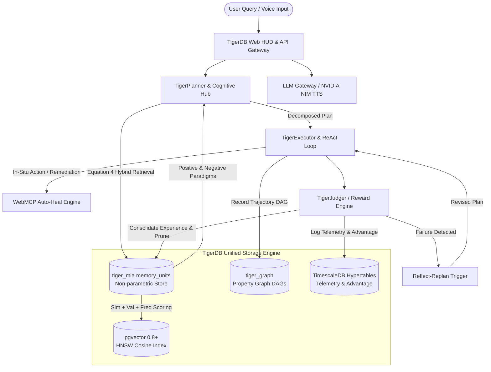

# TigerDB: Unified Graph & Vector Database for Memory Intelligence Agent (MIA)

[](https://fastapi.tiangolo.com)
[](https://react.dev)
[](https://www.postgresql.org)
[](https://www.timescale.com)
[](https://github.com/pgvector/pgvector)
[](https://build.nvidia.com)
[](https://render.com)
[](https://arxiv.org/abs/2604.04503)

An enterprise-grade implementation of the **Memory Intelligence Agent (MIA)** lifelong learning framework ([arXiv:2604.04503v4](https://arxiv.org/abs/2604.04503)), powered by **TigerDB** — a unified multi-model engine combining **PostgreSQL 18**, **TimescaleDB HA**, **pgvector**, and a native **Property Graph Model**.

Includes a full-stack **Desktop Memory Agent Web HUD** with real-time Graph DAG visualization, speech-enabled AI assistant, morning briefings, in-situ WebMCP auto-healing, and a zero-downtime deployment container for Render.com.

---

## 📑 Table of Contents

- [1. Theoretical Foundations (MIA Paper arXiv:2604.04503)](#1-theoretical-foundations-mia-paper-arxiv260404503)
  - [1.1 Equation 4: Non-Parametric Hybrid Retrieval Scoring](#11-equation-4-non-parametric-hybrid-retrieval-scoring)
  - [1.2 Multimodal Semantic Similarity (Eq. 9)](#12-multimodal-semantic-similarity-eq-9)
  - [1.3 Dual Paradigm Extraction (Positive vs. Negative Paradigms)](#13-dual-paradigm-extraction-positive-vs-negative-paradigms)
  - [1.4 Shortest Path Execution Prioritization](#14-shortest-path-execution-prioritization)
  - [1.5 High Semantic Similarity Knowledge Replacement](#15-high-semantic-similarity-knowledge-replacement)
  - [1.6 Reflect-Replan Mechanism](#16-reflect-replan-mechanism)
  - [1.7 GRPO Trajectory Telemetry in TimescaleDB](#17-grpo-trajectory-telemetry-in-timescaledb)
- [2. System Architecture](#2-system-architecture)
  - [2.1 Architectural Flow Diagram](#21-architectural-flow-diagram)
  - [2.2 The 4 Storage Layers of TigerDB](#22-the-4-storage-layers-of-tigerdb)
- [3. Application Features & Web HUD](#3-application-features--web-hud)
- [4. Deployment Modes](#4-deployment-modes)
  - [4.1 Render.com Cloud Deployment (Unified Single Docker Container)](#41-rendercom-cloud-deployment-unified-single-docker-container)
  - [4.2 Local Full-Stack with Docker Compose](#42-local-full-stack-with-docker-compose)
  - [4.3 Fault-Tolerant Standalone Mode (Zero Database Required)](#43-fault-tolerant-standalone-mode-zero-database-required)
- [5. How to Use TigerDB & MIA (Tutorial & Workflows)](#5-how-to-use-tigerdb--mia-tutorial--workflows)
  - [5.1 Live Web HUD Walkthrough](#51-live-web-hud-walkthrough)
  - [5.2 Testing Equation 4 Hybrid Retrieval via Python](#52-testing-equation-4-hybrid-retrieval-via-python)
  - [5.3 Ingesting Real-Time Tasks into the Property Graph](#53-ingesting-real-time-tasks-into-the-property-graph)
  - [5.4 Triggering In-Situ WebMCP Actions](#54-triggering-in-situ-webmcp-actions)
  - [5.5 Interacting via Voice & TTS Assistant](#55-interacting-via-voice--tts-assistant)
- [6. REST API Reference](#6-rest-api-reference)
- [7. Directory Structure](#7-directory-structure)

---

## 1. Theoretical Foundations (MIA Paper arXiv:2604.04503)

The **Memory Intelligence Agent (MIA)** is designed to overcome fundamental memory bottlenecks in Deep Research Agents (DRAs): context-window saturation, catastrophic forgetting, and repetitive failure loops. TigerDB translates the theoretical foundations of the paper into SQL stored procedures, HNSW vector queries, recursive CTE graph traversals, and partitioned hypertables.

```
       ┌────────────────────────────────────────────────────────┐
       │                 MIA PAPER ARCHITECTURE                 │
       │                                                        │
       │   Manager  ──> Non-parametric Hybrid Retrieval (Eq. 4) │
       │   Planner  ──> Dual Paradigm In-Context Prompting      │
       │   Executor ──> ReAct Tool Trajectories -> Graph DAG    │
       │   Judger   ──> Reflect-Replan & GRPO Telemetry         │
       └────────────────────────────────────────────────────────┘
```

### 1.1 Equation 4: Non-Parametric Hybrid Retrieval Scoring

Rather than naive vector search which over-indexes on linguistic similarity while ignoring past execution utility, MIA introduces **Hybrid Memory Retrieval (Eq. 4 & Eq. 11)**:

$$\text{Score}(m_i) = \lambda_s \cdot \widehat{\text{Sim}}_i + \lambda_v \cdot \text{Val}_i + \lambda_f \cdot \text{Freq}_i$$

Where:
- $\widehat{\text{Sim}}_i$: Normalized semantic similarity between current input and stored memory unit $m_i$.
- $\text{Val}_i = \frac{s_i}{u_i + 1}$: **Value Reward**, representing historical empirical success rate ($s_i = \text{success count}$, $u_i = \text{usage count}$).
- $\text{Freq}_i = \frac{1}{u_i + 1}$: **Frequency Reward / Novelty Exploration**, favoring less frequently accessed units to prevent over-fitting to narrow trajectories.
- Hyperparameters: $\lambda_s = 0.7$, $\lambda_v = 0.3$, $\lambda_f = 0.3$.

**Implemented in TigerDB via Stored Procedure:**
```sql
SELECT * FROM tiger_mia.hybrid_memory_retrieve(
    p_query_embed => %s::vector,
    p_caption_embed => %s::vector,
    p_judgment_filter => 'correct',
    p_lambda_s => 0.7,
    p_lambda_v => 0.3,
    p_lambda_f => 0.3,
    p_top_k => 4
);
```

### 1.2 Multimodal Semantic Similarity (Eq. 9)

For multimodal tasks involving image captions or document snapshots, semantic similarity combines question text and visual caption vectors:

$$\text{Sim}_i = \alpha_q \cdot \text{sim}(e_q, e_{m_{q,i}}) + \alpha_c \cdot \text{sim}(e_c, e_{m_{c,i}})$$

- $\alpha_q = 0.8$ (text weight)
- $\alpha_c = 0.2$ (visual caption weight)
- $\text{sim}(u, v) = 1 - (u \Leftrightarrow v)$ using `pgvector` cosine operator.

### 1.3 Dual Paradigm Extraction (Positive vs. Negative Paradigms)

Traditional memory models only retrieve successful examples ($T_{succ}$). MIA demonstrates that **negative examples ($T_{fail}$)** are equally vital to prevent agents from falling into recurring pitfalls:

1. **Positive Paradigms ($\mathcal{P}^+$)**: High-scoring historical trajectories marked `judgment_label = 'correct'`. These provide the Planner with proven subgoal sequences and tool invocation patterns.
2. **Negative Paradigms ($\mathcal{P}^-$)**: High-similarity historical trajectories marked `judgment_label = 'incorrect'`. These warn the Planner against known dead ends (e.g. port conflicts, missing dependencies, hallucinated endpoints).

### 1.4 Shortest Path Execution Prioritization

Among multiple candidates in $\mathcal{P}^+$, MIA prioritizes the **most concise execution trajectory**:

$$T_{succ}^* = \arg\min_{\tau \in \mathcal{P}^+} \text{Length}(\tau)$$

Longer trajectories often contain redundant tool calls or recovered errors. In TigerDB, this is executed by sorting retrieved positive paradigms by `(execution_length ASC, final_score DESC)`.

### 1.5 High Semantic Similarity Knowledge Replacement

To prevent unbounded memory growth while keeping knowledge current, MIA implements **Experience Consolidation with Semantic Replacement**:

$$\text{If } \max_{m_j \in \mathcal{M}} \text{CosineSim}(e_{q, \text{new}}, e_{q, m_j}) \ge \tau \ (0.92):$$

The agent performs **Knowledge Replacement**: updates $m_j$'s compressed workflow, increments usage/success metrics, and replaces the underlying graph DAG, rather than inserting duplicate redundant rows.

### 1.6 Reflect-Replan Mechanism

When an agent encounters a step failure (or negative paradigm match):
1. Execution halts before cascading failures occur.
2. A single **Reflect-Replan** turn is triggered (`max_reflection_turns = 1`).
3. The Judger diagnoses the failure cause (e.g. `Port 5432 conflict on tiger-timescaledb`).
4. The Planner generates a revised plan incorporating a remediation action (e.g. WebMCP auto-heal or alternative tool).

### 1.7 GRPO Trajectory Telemetry in TimescaleDB

MIA tracks test-time learning progression via **Group Relative Policy Optimization (GRPO)** rewards:

$$R_{\text{total}} = r_{\text{correctness}} + r_{\text{tool}} + r_{\text{format}}$$
$$A_i = \frac{R_i - \bar{R}}{\sigma_R + \epsilon}$$

Telemetry is continuously streamed into TimescaleDB hypertables partitioned by time chunks, enabling instant telemetry analytics with 90%+ columnar compression.

---

## 2. System Architecture

### 2.1 Architectural Flow Diagram



### 2.2 The 4 Storage Layers of TigerDB

| Layer | Engine | Schema / Tables | Responsibility |
|:---|:---|:---|:---|
| **Layer 1: Vector** | `pgvector` 0.8+ | `tiger_mia.memory_units (question_embedding, caption_embedding)` | 384-dimensional dense semantic vectors with HNSW indexing (`vector_cosine_ops`) for sub-millisecond retrieval. |
| **Layer 2: Graph** | Native Property Graph | `tiger_graph.graph_nodes`, `tiger_graph.graph_edges` | Models execution DAGs (nodes: questions, subgoals, tool calls, observations, promises; edges: `DECOMPOSES_TO`, `CALLS_TOOL`, `PRODUCES_OUTPUT`, `COMMITTED_TO`). Queried via recursive CTEs. |
| **Layer 3: Non-parametric** | Hybrid Knowledge Store | `tiger_mia.memory_units`, `hybrid_memory_retrieve()`, `upsert_memory_unit()` | Lifelong experience consolidation, Equation 4 hybrid scoring, positive/negative paradigm separation, and threshold $\tau=0.92$ knowledge replacement. |
| **Layer 4: Time-Series** | TimescaleDB HA PG18 | `tiger_mia.trajectory_logs` | Partitioned hypertables tracking step count, correctness, tool rewards, and GRPO advantage trajectories over time. |

---

## 3. Application Features & Web HUD

The included frontend is a modern, responsive web console styled with clean aesthetics:

1. **"Open My Brain" Morning Standup Briefing**:
   - Synthesizes yesterday's unfinished work items.
   - Detects failures and negative paradigms that require attention.
   - Outlines today's prioritized agenda with direct action triggers.
2. **"Where Did I Leave It?" Timeline Retrieval**:
   - Real-time semantic memory search over desktop files, terminal runs, and browser tabs.
   - Extracts explicit user commitments and promises (e.g. *"Email Rahul revised pricing by Friday"*).
3. **Interactive Property Graph Visualizer (DAG)**:
   - Interactive DAG viewer with node inspectors, zoom/pan controls, and color-coded node taxonomy.
   - Renders complete ReAct trajectories traversed via recursive CTEs.
4. **Live In-Situ Task Ingestion Simulator**:
   - Ingests new desktop tasks live into the Property Graph and Vector engine.
   - Instant live visual feedback showing the resulting node DAG.
5. **WebMCP Auto-Healing Actions**:
   - Direct execution of remediation tasks from Negative Paradigms without copy-pasting.
   - Container auto-healing (`docker_heal`), file opening (`open_file`), email drafting (`draft_email`).
6. **Voice Assistant with Spoken TTS**:
   - Uses browser Web Speech API for real-time speech-to-text.
   - Queries TigerDB vector and graph memory.
   - Uses NVIDIA NIM LLM to synthesize concise voice answers, code snippets, or interactive HTML widgets.

---

## 4. Deployment Modes

### 4.1 Render.com Cloud Deployment (Unified Single Docker Container)

The repository includes a multi-stage [Dockerfile](file:///c:/Users/venka/TigerDB/Dockerfile) that packages both the React frontend and FastAPI backend into a single container suitable for Render's free tier.

#### Deploy via Render Dashboard:
1. Open [dashboard.render.com](https://dashboard.render.com).
2. Click **New +** → **Web Service**.
3. Connect your repository: `https://github.com/Niteesh57/tigerdb.git`.
4. Configure service:
   - **Runtime**: `Docker`
   - **Dockerfile Path**: `./Dockerfile`
   - **Plan**: `Free`
5. *(Optional)* Add Environment Variables:
   - `NVIDIA_API_KEY`: *(Optional)* Your NVIDIA NIM key (`nvapi-...`).
   - `NVIDIA_MODEL`: `meta/llama-3.2-11b-vision-instruct`
6. Click **Create Web Service**.

#### Deploy via Render Blueprint (`render.yaml`):
Click **New +** → **Blueprint**, select your repo, and Render will read [render.yaml](file:///c:/Users/venka/TigerDB/render.yaml) automatically.

### 4.2 Local Full-Stack with Docker Compose

To run the complete PostgreSQL 18 + TimescaleDB HA + pgvector stack locally:

```bash
# 1. Start the TimescaleDB HA + pgvector container
docker compose up -d

# 2. Install Python dependencies
pip install -r requirements.txt

# 3. Seed demo desktop memories into TigerDB
python examples/seed_desktop_memory.py

# 4. Start the backend API server
uvicorn tiger_agent.api:app --host 0.0.0.0 --port 8000

# 5. Start the Vite React development server
cd frontend
npm install
npm run dev
```

Open `http://localhost:5173` to view the Web HUD.

### 4.3 Fault-Tolerant Standalone Mode (Zero Database Required)

> **"db is not there you don't raise error just leave it give output"**

If PostgreSQL / TimescaleDB is not provisioned or is temporarily offline (e.g. running on Render without an attached managed database):
- **Zero Startup Crashes**: [tiger_mia/db.py](file:///c:/Users/venka/TigerDB/tiger_mia/db.py) uses a non-blocking connection check with 30s status caching.
- **In-Memory Graph & Vector Fallbacks**: [tiger_agent/desktop_memory.py](file:///c:/Users/venka/TigerDB/tiger_agent/desktop_memory.py) maintains an in-memory knowledge store with deterministic vector embeddings.
- **200 OK Responses**: Every API endpoint returns rich structured data and connected DAG graphs instead of raising 500 exceptions.
- **Automatic Reconnection**: If a database becomes reachable later, TigerDB seamlessly switches to persistent mode without restarts.

---

## 5. How to Use TigerDB & MIA (Tutorial & Workflows)

### 5.1 Live Web HUD Walkthrough

1. **Accessing the Web Console**:
   Navigate to `http://localhost:5173` (local dev) or `http://localhost:8000` (Docker container).
2. **Reviewing the Morning Briefing**:
   The top 3 cards display yesterday's unfinished work, active blockers, and today's agenda. Click **"Auto-Heal Container"** to trigger a WebMCP in-situ remediation.
3. **Searching Timeline Memory**:
   In the search bar, type `proposal` or `docker` and press Enter. The agent searches memory units using cosine similarity and returns the matching event along with user commitments.
4. **Opening the Memory Architecture Inspector**:
   Click the **"View Memories"** pill in the top header. This opens the 5-tab inspector:
   - **Tab 1 (Property Graph DAG)**: View topological ReAct execution graphs. Click any node to inspect its JSONB attributes and edge connections.
   - **Tab 2 (Live Task Simulator)**: Click a preset (e.g. *"🐳 Kafka Docker Setup"*) and click **"Ingest Task"** to watch TigerDB insert nodes and edges in real time.
   - **Tab 3 (Memory Units & Paradigms)**: View Equation 4 scores, positive paradigms, and negative failure modes.
   - **Tab 4 (TimescaleDB Telemetry)**: Review hypertable trajectory logs, GRPO reward components, and advantage scores.
   - **Tab 5 (System Architecture)**: Complete reference diagram of the TigerDB multi-model engine.

### 5.2 Testing Equation 4 Hybrid Retrieval via Python

Run the interactive MIA hybrid retrieval script:

```python
from tiger_mia.memory_manager import TigerMemoryManager

manager = TigerMemoryManager()

# Run Equation 4 hybrid search
results = manager.retrieve_hybrid(
    question="Docker compose deployment conflict",
    category="terminal",
    top_k=3
)

print("--- Positive Paradigms (Shortest Path First) ---")
for p in results["positive_paradigms"]:
    print(f"[{p['judgment_label']}] Score: {p.get('final_score', 0):.3f} | Steps: {p.get('execution_length')} | Q: {p['question']}")

print("\n--- Negative Paradigms (Pitfalls to Avoid) ---")
for n in results["negative_paradigms"]:
    print(f"[{n['judgment_label']}] Score: {n.get('final_score', 0):.3f} | Warning: {n['question']}")
```

### 5.3 Ingesting Real-Time Tasks into the Property Graph

Ingest an activity programmatically using the `DesktopMemoryManager`:

```python
from tiger_agent.desktop_memory import DesktopMemoryManager

mem = DesktopMemoryManager()
record = mem.record_activity(
    title="Kafka cluster configuration",
    activity_type="terminal",
    path_or_url="/etc/kafka/server.properties",
    snippet="Configured broker.id=1, listeners=PLAINTEXT://:9092, num.partitions=3",
    promise_text="Verify consumer lag metrics by Monday",
    judgment_label="correct"
)

print(f"Created Memory ID: {record['memory_id']}")
print(f"Generated Property Graph ID: {record['graph_id']}")
```

### 5.4 Triggering In-Situ WebMCP Actions

Execute actions directly through the WebMCP engine:

```bash
# Execute container auto-healing via REST API
curl -X POST http://localhost:8000/api/webmcp/execute \
  -H "Content-Type: application/json" \
  -d '{"action": "docker_heal", "params": {"container": "tiger-timescaledb"}}'
```

### 5.5 Interacting via Voice & TTS Assistant

Send a spoken transcript to the voice interaction endpoint:

```bash
curl -X POST http://localhost:8000/api/voice/interact \
  -H "Content-Type: application/json" \
  -d '{"transcript": "Where did I leave the client proposal?"}'
```

**Sample Response:**
```json
{
  "transcript": "Where did I leave the client proposal?",
  "format": "general",
  "speakingtext": "You were editing client_proposal.docx yesterday at 4:20 PM in Projects. You promised to email Rahul revised pricing by Friday.",
  "content": "",
  "results": [
    {
      "title": "client_proposal.docx",
      "time": "Yesterday 4:20 PM",
      "path_or_url": "Projects/client_proposal.docx",
      "promise": "Send revised pricing proposal to Rahul by Friday 5 PM.",
      "similarity": 0.94
    }
  ]
}
```

---

## 6. REST API Reference

| Method | Endpoint | Description |
|:---|:---|:---|
| `GET` | `/api/health` | Returns database health, offline simulation status, node counts, and LLM gateway status. |
| `GET` | `/api/morning/briefing` | Returns the 3-tile Morning Standup Briefing (unfinished work, blockers, today's agenda). |
| `POST` | `/api/memory/query` | Searches timeline memory using semantic vector similarity and returns synthesis. |
| `GET` | `/api/timeline` | Returns recent desktop activities and commitments in reverse chronological order. |
| `GET` | `/api/graph/{graph_id}` | Traverses and returns graph nodes & edges for visual DAG rendering via recursive CTE. |
| `GET` | `/api/memory/overview` | Returns engine statistics, positive/negative memory units, DAG samples, and TimescaleDB logs. |
| `POST` | `/api/memory/mia-search` | Executes Equation 4 hybrid scoring and returns partitioned positive and negative paradigms. |
| `POST` | `/api/memory/record` | Ingests a new activity into both Property Graph and Vector stores. |
| `POST` | `/api/webmcp/execute` | Executes an in-situ system action (`docker_heal`, `open_file`, `draft_email`). |
| `POST` | `/api/voice/interact` | Voice assistant endpoint: combines memory retrieval, NVIDIA NIM reasoning, and TTS formatting. |
| `POST` | `/api/seed` | Seeds or refreshes sample desktop memories into TigerDB. |

---

## 7. Directory Structure

```
TigerDB/
├── .dockerignore                     # Excludes node_modules, .env, and caches from Docker
├── .gitignore                        # Protects secrets and build artifacts
├── DEPLOY_RENDER.md                  # Comprehensive guide for Render.com deployment
├── Dockerfile                        # Multi-stage production build (Vite + FastAPI)
├── README.md                         # Complete project documentation & MIA paper guide
├── STUDY_GUIDE.md                    # In-depth study and demo walkthrough for Memory Inspector
├── DEMO_SCRIPT_3MIN.md               # 3-minute executive presentation script
├── docker-compose.yml                # Local TimescaleDB HA + pgvector container configuration
├── init-tigerdb.sql                  # Database schema, stored procedures, & hypertable DDL
├── render.yaml                       # Render.com Blueprint deployment configuration
├── requirements.txt                  # Python dependencies
│
├── tiger_mia/                        # Core MIA Engine (arXiv:2604.04503)
│   ├── config.py                     # Configuration settings & DATABASE_URL parser
│   ├── db.py                         # Fault-tolerant TigerDB client with offline fallback
│   ├── graph_engine.py               # Property Graph storage & recursive CTE traversal
│   ├── memory_manager.py             # Eq. 4 Hybrid retrieval, consolidation, & embedder
│   ├── planner.py                    # Dual paradigm in-context prompt constructor
│   ├── executor.py                   # ReAct rollout execution loop
│   └── judger.py                     # Evaluation, reward calculation, & Reflect-Replan
│
├── tiger_agent/                      # Desktop Memory Agent & API
│   ├── api.py                        # FastAPI REST API & static file server
│   ├── desktop_memory.py             # Desktop activity recorder & timeline retriever
│   ├── morning_assistant.py          # Morning briefing generator
│   ├── llm_client.py                 # NVIDIA NIM LLM gateway with structured output
│   └── webmcp_actions.py             # In-situ WebMCP remediation actions engine
│
├── frontend/                         # Vite React Web HUD
│   ├── package.json
│   ├── vite.config.js
│   ├── src/
│   │   ├── App.jsx                   # Main Web HUD layout
│   │   ├── index.css                 # Clean, modern design system
│   │   ├── api/client.js             # Dynamic API client (supports dev & cloud deploy)
│   │   └── components/
│   │       ├── Header.jsx            # Top bar with health indicators & Inspector button
│   │       ├── MorningBriefing.jsx   # 3-tile morning standup cards
│   │       ├── MemorySearchBar.jsx   # Semantic search bar with direct synthesis
│   │       ├── TimelineReel.jsx      # Chronological desktop activities & commitments
│   │       ├── MemoryInspectorModal.jsx # 5-tab Architecture & Live Inspector modal
│   │       ├── VoiceAssistantPopup.jsx  # Floating speech-to-text voice assistant
│   │       └── WebMCPActionModal.jsx    # In-situ action execution modal
│
├── examples/
│   ├── run_mia_deep_research.py      # End-to-end MIA paper demonstration script
│   └── seed_desktop_memory.py        # Seed script for realistic desktop events
│
└── tests/                            # Automated test suite
    ├── test_vector_engine.py         # Vector similarity and HNSW tests
    ├── test_graph_engine.py          # Property graph creation and recursive CTE tests
    ├── test_mia_retrieval.py         # Equation 4 hybrid scoring unit tests
    └── test_agent_api.py             # FastAPI endpoint tests
```

---

## 📚 References

- **MIA Paper**: *Lifelong Memory for Deep Research Agents: Dual Paradigm Extraction, Non-parametric Hybrid Scoring, and Experience Consolidation* ([arXiv:2604.04503v4](https://arxiv.org/abs/2604.04503)).
- **TimescaleDB Documentation**: [Self-hosted TimescaleDB HA on Docker](https://docs.timescale.com/self-hosted/latest/).
- **pgvector**: [Open-source vector similarity search for PostgreSQL](https://github.com/pgvector/pgvector).
- **FastAPI**: [Modern, fast web framework for building APIs](https://fastapi.tiangolo.com).
- **NVIDIA NIM**: [Optimized inference microservices for state-of-the-art models](https://build.nvidia.com).
